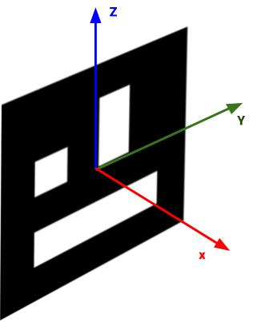
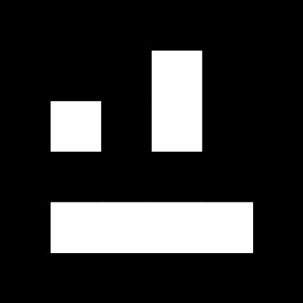
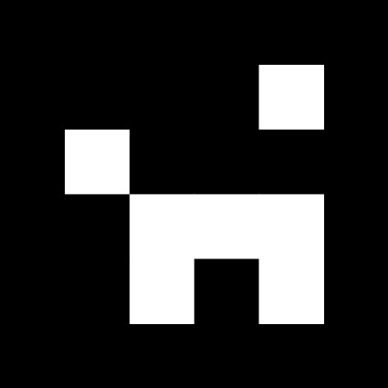
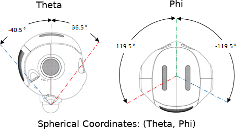

# Aruco Detection Library

This Android library will help you:

* Search and detect Aruco markers with Pepper
* Make Pepper reach the marker locations, align with them

## Table of Content

   * [1. Video demonstration](#1-video-demonstration)
   * [2. Version History](#2-version-history)
   * [3. Aruco markers](#3-aruco-markers)
   * [4. Getting started](#4-getting-started)
      * [4.1. Running the sample app](#41-running-the-sample-app)
      * [4.2. Print Aruco markers](#42-print-aruco-markers)
   * [5. Using the library in your project](#5-using-the-library-in-your-project)
      * [5.1. Add the library as a dependency](#51-add-the-library-as-a-dependency)
      * [5.2. Add OpenCV libraries](#52-add-opencv-libraries)
         * [5.2.1. Add OpenCV native libraries](#521-add-opencv-native-libraries)
         * [5.2.2. Use OpenCV external APK](#522-use-opencv-external-apk)
   * [6. Usage](#6-usage)
      * [6.1. Prerequisite: load OpenCV in our Activity](#61-prerequisite:-load-opencv-in-our-activity)
      * [6.2. `DetectArucoMarker` action](#62-detectarucomarker-action)
         * [6.2.1. Goal](#621-goal)
         * [6.2.2. Typical usage](#622-typical-usage)
         * [6.2.3. Example](#623-example)
         * [6.2.4. How to use it](#624-how-to-use-it)
            * [6.2.4.1. Detected aruco markers](#6241-detected-aruco-markers)
            * [6.2.4.2. Camera shake](#6242-camera-shake)
         * [6.2.5. Tuning the `DetectArucoMarker` behavior](#625-tuning-the-detectarucomarker-behavior)
            * [6.2.5.1. Aruco marker size](#6251-aruco-marker-size)
            * [6.2.5.2. Aruco marker dictionary](#6252-aruco-marker-dictionary)
            * [6.2.5.3. Pepper camera matrix](#6253-pepper-camera-matrix)
            * [6.2.5.4. Pepper camera distortion coef](#6254-pepper-camera-distortion-coef)
            * [6.2.5.5. Aruco marker Frame localization policy](#6255-aruco-marker-frame-localization-policy)
      * [6.3. `LookAroundAndDetectArucoMarker` action](#63-lookaroundanddetectarucomarker-action)
         * [6.3.1. Goal](#631-goal)
         * [6.3.2. Typical usage](#632-typical-usage)
         * [6.3.3. Example](#633-example)
         * [6.3.4. How to use it](#634-how-to-use-it)
            * [6.3.4.1. Detected aruco markers](#6341-detected-aruco-markers)
         * [6.3.5. Tunning the `LookAroundAndDetectArucoMarker` behavior](#635-tunning-the-lookaroundanddetectarucomarker-behavior)
            * [6.3.5.1. Aruco markers detection parameters](#6351-aruco-markers-detection-parameters)
            * [6.3.5.2. LookAt movement Policy](#6352-lookat-movement-policy)
            * [6.3.5.3. Specifying LookAt targets as a list of Frames](#6353-specifying-lookat-targets-as-a-list-of-frames)
            * [6.3.5.4. Specifying LookAt targets as a list of Transforms](#6354-specifying-lookat-targets-as-a-list-of-transforms)
            * [6.3.5.5. Specifying LookAt targets as a list of Spherical Coordinates](#6355-specifying-lookat-targets-as-a-list-of-spherical-coordinates)
            * [6.3.5.6. Termination callback](#6356-termination-callback)
            * [6.3.5.7. Aruco marker validation callback](#6357-aruco-marker-validation-callback)
            * [6.3.5.8. Aruco marker detected listener](#6358-aruco-marker-detected-listener)
      * [6.4. `GoToMarkerAndCheckItsPositionOnTheWay` action](#64-gotomarkerandcheckitspositionontheway-action)
         * [6.4.1. Goal](#641-goal)
         * [6.4.2. Typical usage](#642-typical-usage)
         * [6.4.3. Example](#643-example)
         * [6.4.4. How to use it](#644-how-to-use-it)
            * [6.4.4.1. Set the Aruco Marker](#6441-set-the-aruco-marker)
         * [6.4.5. Tuning the `GoToMarkerAndCheckItsPositionOnTheWay` behavior](#645-tuning-the-gotomarkerandcheckitspositionontheway-behavior)
            * [6.4.5.1. Align Pepper Body X Axis with Aruco Marker Z Axis](#6451-align-pepper-body-x-axis-with-aruco-marker-z-axis)
            * [6.4.5.2. Walking animation](#6452-walking-animation)
            * [6.4.5.3. Max Speed](#6453-max-speed)
            * [6.4.5.4. Distance between Stops](#6454-distance-between-stops)
      * [6.5. `ArucoMarker` object](#65-arucomarker-object)
         * [6.5.1. What it is](#651-what-it-is)
         * [6.5.2. How to use it](#652-how-to-use-it)
            * [6.5.2.1. Saving `ArucoMarker` for future use](#6521-saving-arucomarker-for-future-use)
            * [6.5.2.2. Loading `ArucoMarker` from its saved content](#6522-loading-arucomarker-from-its-saved-content)
            * [6.5.2.3. Computing the `ArucoMarker` orientation](#6523-computing-the-arucomarker-orientation)
            * [6.5.2.4. Checking if the `ArucoMarker` is on the floor](#6524-checking-if-the-arucomarker-is-on-the-floor)
   * [7. Advanced usage](#7-advanced-usage)
      * [7.1. Use a different version of OpenCV](#71-use-a-different-version-of-opencv)
      * [7.2. Extending the lib](#72-extending-the-lib)
         * [7.2.1. Full OpenCV Aruco documentation by developer](#721-full-opencv-aruco-documentation-by-developer)
   * [8. License](#8-license)


## 1. Video demonstration

This video was filmed at SoftBank Robotics Europe, and shows Pepper detecting and navigating toward aruco marker placed in the SBRE Showroom.

[<div align="center"></div>](https://www.youtube.com/watch?v=YwWUTFxySWU)

## 2. Version History

Note: This 2.0 version is not backward compatible with previous releases, as there have been major changes, see the [changelog](CHANGELOG.md) for details

## 3. Aruco markers

An Aruco marker is a synthetic square marker composed by a wide black border and an inner binary matrix. The black border facilitates its fast detection in the image and the binary codification allows its identification and the application of error detection and correction techniques. The markers can be of different size, 4x4, 5x5 or 6x6.

Some examples of ArUco markers:

<div align="center">
    
</div>

A dictionary of markers is the set of markers that are considered in a specific application.
Each marker has an id. This id is the marker index within the dictionary it belongs to.

The markers have an orientation. In this library, we define the Aruco axis as follow:

<div align="center">
    

</div>

We chose this coordinate system to be consistent with Pepper QiSDK coordinate system. Beware however as OpenCV uses another coordinate system on material you'll find out there on the internet.


## 4. Getting started

### 4.1. Running the sample app

The project comes complete with a sample project. You can clone the repository, open it in Android Studio, and run this directly onto a Robot.

The sample application contains a tutorial that will demonstrate what you can do with the library.
You will need to have Aruco Markers in order to play with the tutorial. See [Print Aruco markers](#22-print-aruco-markers)

### 4.2. Print Aruco markers

You can generate Aruco Markers, for instance with [this website](http://chev.me/arucogen/).
Choose 4x4 aruco markers, of size 150mm, and pick an ID below 50.

If you want you can also directly print the following markers (click on each image to open them):

[](doc/img/4x4_1000-13.svg)
[](doc/img/4x4_1000-36.svg)
[](doc/img/4x4_1000-41.svg)

## 5. Using the library in your project

### 5.1. Add the library as a dependency

[Follow these instructions](https://jitpack.io/#softbankrobotics-labs/pepper-aruco)

Make sure to replace 'Tag' by the number of the version of the library you want to use, or by 'master-SNAPSHOT' to use the master branch.


### 5.2. Add OpenCV libraries

You have two options to add the OpenCV libraries to your project:

#### 5.2.1. Add OpenCV native libraries

With this method you directly add the libraries to your apk. The disadvantage of this method is that your apk will become very big.

Copy the .so files you will find in the folder [pepperaruco/src/main/jniLibs](pepperaruco/src/main/jniLibs) into your own src/main folder.
Android studio will automatically find and include these libraries into your apk.


#### 5.2.2. Use OpenCV external APK

With this method, the opencv libraries are not installed with your apk, you need to install them separately on the robot.

To install OpenCV manager APK, connect to your robot ip (for instance 10.0.204.180) with adb and install the package you will find in the folder [opencv-apk](opencv-apk/):

```
$ adb connect 10.0.204.180:5555
$ adb install opencv-apk/OpenCV_3.4.7-dev_Manager_3.47_armeabi-v7a.apk
```

## 6. Usage

### 6.1. Prerequisite: load OpenCV in our Activity

In your Activity class, you need to load opencv in the `onCreate` method in order to be able to use the library. To do so, call `OpenCVUtils.loadOpenCV(this)`:

```kotlin

class MyActivity : AppCompatActivity(), RobotLifecycleCallbacks {

    override fun onCreate(savedInstanceState: Bundle?) {
        super.onCreate(savedInstanceState)

        OpenCVUtils.loadOpenCV(this)
        //...
    }
```

### 6.2. `DetectArucoMarker` action

#### 6.2.1. Goal

Detect an Aruco marker with Pepper Top Camera.

#### 6.2.2. Typical usage

Use it whenever you want to detect if there are Aruco markers in Pepper vision field.
You have to turn Pepper's head yourself toward the Aruco marker using a [`LookAt`](https://developer.softbankrobotics.com/pepper-qisdk/api/motion/reference/lookat) or an [`ExtraLookAt`](https://github.com/softbankrobotics-labs/pepper-extras#31-extralookat). If you don't want to handle Pepper's head orientation, use [`LookAroundAndDetectArucoMarker`](#53-lookaroundanddetectarucomarker-action).

#### 6.2.3. Example

The following example will detect Aruco markers in Pepper's field of view, and display the number of markers detected, as well as the id of each detected marker.

```Kotlin
// Create the action
val detectAruco: DetectArucoMarker = DetectArucoMarkerBuilder.with(qiContext)
    .withMarkerLength(0.15)
    .withDictionary(ArucoDictionary.DICT_4X4_100)
    .withArucoMarkerFrameLocalizationPolicy(ArucoMarkerFrameLocalizationPolicy.DETACHED)
    .build()

// Run it
val arucoMarkers: Set<ArucoMarker> = detectAruco.run()

// Display the result
Log.i(TAG, "Pepper detected ${arucoMarkers.size} marker(s)")
arucoMarkers.forEach { marker ->
    Log.i(TAG, "- marker $marker.id")
}
```
#### 6.2.4. How to use it

##### 6.2.4.1. Detected aruco markers

The `DetectArucoMarker` action returns a set of [`ArucoMarker`s](#45-arucomarker-object) objects corresponding to the markers that were detected by Pepper using its Top Camera.

##### 6.2.4.2. Camera shake

Camera shake will prevent correct detection of Aruco markers. Make sure Pepper head stays still while you use the `DetectArucoMarker` action. We advise that you [hold `BasicAwareness` as well as `BackgroundMovement`](https://developer.softbankrobotics.com/pepper-qisdk/api/autonomous-abilities/reference/autonomous-abilities) while you run the `DetectArucoMarker` action.


#### 6.2.5. Tuning the `DetectArucoMarker` behavior


##### 6.2.5.1. Aruco marker size

```Kotlin
fun DetectArucoMarkerBuilder.withMarkerLength(markerLength: Double): DetectArucoMarkerBuilder
```

Set the size of the side of the Aruco markers. In meters.
By default, `DetectArucoMarker` uses 0.15 meters.

##### 6.2.5.2. Aruco marker dictionary

```Kotlin
fun DetectArucoMarkerBuilder.withDictionary(dictionary: ArucoDictionary): DetectArucoMarkerBuilder
```

A dictionary of markers is the set of markers that are considered in a specific application.
The main properties of a dictionary are the dictionary size and the marker size.

* The dictionary size is the number of markers that compose the dictionary.
* The marker size is the size of those markers (the number of bits).

By default, `DetectArucoMarker` use `ArucoDictionary.DICT_4X4_50`.


##### 6.2.5.3. Pepper camera matrix

```Kotlin
fun DetectArucoMarkerBuilder.withCameraMatrix(cameraMatrix: HashMap<Pair<Int, Int>, DoubleArray>): DetectArucoMarkerBuilder
```

You normally should not have to set this parameter. It's the calibration parameter of the Top Camera.
It allows you to set the camera matrix parameter used by OpenCV.

By default, `DetectArucoMarker` uses the matrix defined in `PepperRobotData.HEAD_CAMERA_MATRIX`.

##### 6.2.5.4. Pepper camera distortion coef

```Kotlin
fun DetectArucoMarkerBuilder.withDistortionCoefs(distortionCoefs: DoubleArray): DetectArucoMarkerBuilder
```

You normally should not have to set this parameter. It's the calibration parameter of the Top Camera.
It allows you to set the distortion coefficient parameter used by OpenCV.

By default, `DetectArucoMarker` uses the coefficients defined in `PepperRobotData.HEAD_CAMERA_DISTORTION_COEFS`.


##### 6.2.5.5. Aruco marker Frame localization policy

```Kotlin
fun DetectArucoMarkerBuilder.withArucoMarkerFrameLocalizationPolicy(policy: ArucoMarkerFrameLocalizationPolicy): DetectArucoMarkerBuilder
```

When Aruco markers are detected, the [`Frame`](https://developer.softbankrobotics.com/pepper-qisdk/api/motion/reference/frame) that represent their position can be:

* `ArucoMarkerFrameLocalizationPolicy.DETACHED`: This is the Default. Aruco [`Frame`s](https://developer.softbankrobotics.com/pepper-qisdk/api/motion/reference/frame) won't be attached to any frame. With time their positions will be less and less accurate because of robot drift. Only use this when the robot DOES NOT move. If robot moves, then use [`Localize`](https://developer.softbankrobotics.com/pepper-qisdk/api/motion/reference/localize) action and choose `ATTACHED_TO_MAPFRAME`
* `ArucoMarkerFrameLocalizationPolicy.ATTACHED_TO_MAPFRAME`: Choose `ATTACHED_TO_MAPFRAME` when [`Localize`](https://developer.softbankrobotics.com/pepper-qisdk/api/motion/reference/localize) or [`LocalizeAndMap`](https://developer.softbankrobotics.com/pepper-qisdk/api/motion/reference/localizeandmap) is running. Aruco [`Frame`s](https://developer.softbankrobotics.com/pepper-qisdk/api/motion/reference/frame) will be attached to [`mapFrame`](https://developer.softbankrobotics.com/pepper-qisdk/api/motion/reference/frame#map-frame), and their positions will be automatically corrected and stay accurate.

### 6.3. `LookAroundAndDetectArucoMarker` action

#### 6.3.1. Goal

Look around Pepper to search for Aruco markers on the floor, on the wall.

#### 6.3.2. Typical usage

Use it whenever you want to detect the Aruco markers that are around Pepper.
This action handles the moving of Pepper and the detection of markers for you.

#### 6.3.3. Example


The following example will detect Aruco markers on the floor in front of Pepper, and display the number of markers detected, as well as the id of each marker detected.

```Kotlin
// Create the action
val lookAroundAndDetect: LookAroundAndDetectArucoMarker =
    LookAroundAndDetectArucoMarkerBuilder.with(qiContext)
        .withMarkerLength(0.15)
        .withDictionary(ArucoDictionary.DICT_4X4_100)
        .withArucoMarkerFrameLocalizationPolicy(ArucoMarkerFrameLocalizationPolicy.DETACHED)
        .withLookAtMovementPolicy(LookAtMovementPolicy.HEAD_AND_BASE)
        .withLookAtSphericalCoordinates(120.0 to 0.0, 120.0 to 20.0, 120.0 to -20.0)
        .build()

// Run it
val arucoMarkers: Set<ArucoMarker> = lookAroundAndDetect.run()

// Display the result
Log.i(TAG, "Pepper detected ${arucoMarkers.size} marker(s)")
arucoMarkers.forEach { marker ->
    Log.i(TAG, "- marker $marker.id")
}
```

#### 6.3.4. How to use it

##### 6.3.4.1. Detected aruco markers

The `LookAroundAndDetectArucoMarker` action returns a set of [`ArucoMarker`s](#45-arucomarker-object) objects corresponding to the markers that were detected by Pepper.

#### 6.3.5. Tunning the `LookAroundAndDetectArucoMarker` behavior

##### 6.3.5.1. Aruco markers detection parameters

This action relies on `DetectArucoMarker` under the hood. So you can set the same parameters as in `DetectArucoMarker`:

* the [marker size](#4243-aruco-marker-size)

```Kotlin
fun LookAroundAndDetectArucoMarkerBuilder.withMarkerLength(markerLength: Double): LookAroundAndDetectArucoMarkerBuilder
```

* the [aruco dictionary](#4244-aruco-marker-dictionary)

```Kotlin
fun LookAroundAndDetectArucoMarkerBuilder.withDictionary(dictionary: ArucoDictionary): LookAroundAndDetectArucoMarkerBuilder {
```

* the [camera matrix](#4245-pepper-camera-matrix)

```Kotlin
fun LookAroundAndDetectArucoMarkerBuilder.withCameraMatrix(cameraMatrix: HashMap<Pair<Int, Int>, DoubleArray>): LookAroundAndDetectArucoMarkerBuilder
```

* the [camera distortion coefficients](#4246-pepper-camera-distortion-coef)

```Kotlin
fun LookAroundAndDetectArucoMarkerBuilder.withDistortionCoefs(distortionCoefs: DoubleArray): LookAroundAndDetectArucoMarkerBuilder
```

* the [markers `Frame` policy](#4247-aruco-marker-frame-localization-policy)

```Kotlin
fun LookAroundAndDetectArucoMarkerBuilder.withArucoMarkerFrameLocalizationPolicy(policy: ArucoMarkerFrameLocalizationPolicy): LookAroundAndDetectArucoMarkerBuilder
```

##### 6.3.5.2. LookAt movement Policy

```Kotlin
fun LookAroundAndDetectArucoMarkerBuilder.withLookAtMovementPolicy(policy: LookAtMovementPolicy): LookAroundAndDetectArucoMarkerBuilder
```

This action relies on [`LookAt`](https://developer.softbankrobotics.com/pepper-qisdk/api/motion/reference/lookat) under the hood. When Pepper looks at locations in search for Aruco markers, you can choose if it should use only his head or also move his mobile base by setting the `LookAtMovementPolicy`.
By default, the `LookAtMovementPolicy` is set to `HEAD_AND_BASE`, but it can be set to `HEAD_ONLY`.
If you choose `HEAD_ONLY`, Pepper will only turn his head to look around. However, if you use `HEAD_AND_BASE`, Pepper will be able to also turn his base.

##### 6.3.5.3. Specifying LookAt targets as a list of Frames

```Kotlin
fun LookAroundAndDetectArucoMarkerBuilder.withLookAtTargetFrame(vararg frame: Frame): LookAroundAndDetectArucoMarkerBuilder
```

`LookAroundAndDetectArucoMarker` requires that you specify a list of target locations where Pepper will look to search for Aruco markers.

You can set the target location as a list of [`Frame`s](https://developer.softbankrobotics.com/pepper-qisdk/api/motion/reference/frame). Pepper will look at the [`Frame`s](https://developer.softbankrobotics.com/pepper-qisdk/api/motion/reference/frame) one after another.

##### 6.3.5.4. Specifying LookAt targets as a list of Transforms

```Kotlin
fun LookAroundAndDetectArucoMarkerBuilder.withLookAtReferenceFrameAndTransforms(lookAtRefFrame: Frame, lookAtTransforms: List<Transform>): LookAroundAndDetectArucoMarkerBuilder
```

`LookAroundAndDetectArucoMarker` requires that you specify a list of target locations where Pepper will look to search for Aruco markers.

You can set the target locations as a reference [`Frame`](https://developer.softbankrobotics.com/pepper-qisdk/api/motion/reference/frame) and a list of [`Transforms`](https://developer.softbankrobotics.com/pepper-qisdk/api/motion/reference/transform-transformtime). Pepper will compute target frames using the reference [`Frame`](https://developer.softbankrobotics.com/pepper-qisdk/api/motion/reference/frame) combined with the transforms, and look at those target [`Frame`s](https://developer.softbankrobotics.com/pepper-qisdk/api/motion/reference/frame) one after another.

The reference [`Frame`](https://developer.softbankrobotics.com/pepper-qisdk/api/motion/reference/frame) usually should not move. Especially if you choose [`gazeFrame`](https://developer.softbankrobotics.com/pepper-qisdk/api/motion/reference/frame#gaze-frame) as the reference frame, do not pass [`gazeFrame`](https://developer.softbankrobotics.com/pepper-qisdk/api/motion/reference/frame#gaze-frame) but a copy of it (use `qiContext.mapping.makeDetachedFrame(gazeFrame)`)


##### 6.3.5.5. Specifying LookAt targets as a list of Spherical Coordinates

```Kotlin
fun LookAroundAndDetectArucoMarkerBuilder.withLookAtSphericalCoordinates(vararg sphericalCoordinates: Pair<Double, Double>): LookAroundAndDetectArucoMarkerBuilder
```

`LookAroundAndDetectArucoMarker` requires that you specify a list of target locations where Pepper will look to search for Aruco markers.

You can set the target location as a list of pairs of spherical coordinates (theta, phi).




Pepper will compute [`Frame`s](https://developer.softbankrobotics.com/pepper-qisdk/api/motion/reference/frame) using these coordinates and look at them one after another.

##### 6.3.5.6. Termination callback

```Kotlin
fun LookAroundAndDetectArucoMarkerBuilder.withTerminationCallback(terminationCallback: LookAroundAndDetectArucoMarker.TerminationCallback): LookAroundAndDetectArucoMarkerBuilder
```

By default the `LookAroundAndDetectArucoMarker` will look at all the target locations you specified, detect if there are Aruco markers at these locations. Then return.

Sometimes you may want to search for a particular Aruco marker, and return immediately once this marker is found. Or you may want to return immediately once any marker is found.
To address these use cases you can set the termination callback. You have to provide a subclass of the interface `TerminationCallback`, with an implementation of the `shouldTerminate` function.

```Kotlin
interface TerminationCallback {
    fun shouldTerminate(currentlyDetectedMarkers: Set<ArucoMarker>): Future<Boolean>
}
```

The `shouldTerminate` function receive a set containing the Aruco marker detected up to now, and must return a [`Future`](https://developer.softbankrobotics.com/pepper-qisdk/principles/chaining-operations#futures) equal to `true` when it is satisfied with the current set of Aruco markers detected and want the action to terminate.

We provide several ready made implementations of `TerminationCallback`:

* `TerminateOnlyWhenLookAroundHasFinished()`: this is the default, it terminates only after Pepper has looked at all locations
* `TerminateWhenSomeMarkersDetected`: terminate whenever a marker is detected, or if none has been detected and Pepper has looked at all locations.
* `TerminateWhenSpecificMarkerDetected(val markerId: Int)`: terminate when the marker with id `markerId` has been detected, or if it has not been detected and Pepper has looked at all locations.


##### 6.3.5.7. Aruco marker validation callback

```Kotlin
fun LookAroundAndDetectArucoMarkerBuilder.withArucoMarkerValidationCallback(callback: LookAroundAndDetectArucoMarker.ArucoMarkerValidationCallback): LookAroundAndDetectArucoMarkerBuilder
```

Discard some of the markers detected by setting the marker validation callback. By default all markers are valid, but you can provide a subclass of `ArucoMarkerValidationCallback`, with an implementation of the `isMarkerValid` function.

```Kotlin
interface ArucoMarkerValidationCallback {
    fun isMarkerValid(marker: ArucoMarker): Future<Boolean>
}
```

The `isMarkerValid` function takes an [`ArucoMarker`s](#45-arucomarker-object) as parameter, and should return a [`Future`](https://developer.softbankrobotics.com/pepper-qisdk/principles/chaining-operations#futures) equal to `true` if it's valid, `false` otherwise.

You can combine marker validation with termination callback:

Let say that there are markers around Pepper on the wall and on the floor, and you want to terminate whenever you see any marker on the floor.
* You could define a validation callback that reject the markers that are not on the floor
* And use `TerminateWhenSomeMarkersDetected` as a termination callback

##### 6.3.5.8. Aruco marker detected listener

```Kotlin
interface OnArucoMarkerDetectedListener {
    fun onArucoMarkerDetected(markers: Set<ArucoMarker>)
}

fun addOnArucoMarkerDetectedListener(listener: OnArucoMarkerDetectedListener)
fun removeOnArucoMarkerDetectedListener(listener: OnArucoMarkerDetectedListener)
fun removeAllOnArucoMarkerDetectedListeners()
```

Observe markers detection by setting the marker detected listener. The listener will be called whenever Pepper detects Aruco markers. The listener has to be a subclass of `OnArucoMarkerDetectedListener` and overload the `onArucoMarkerDetected` function.

### 6.4. `GoToMarkerAndCheckItsPositionOnTheWay` action

#### 6.4.1. Goal

Go to the marker [`Frame`s](https://developer.softbankrobotics.com/pepper-qisdk/api/motion/reference/frame), and on the way to the marker regularly stop and redetect the marker to verify its position.

#### 6.4.2. Typical usage

Use it when you have an Aruco marker on the floor, and you want Pepper to go on top of it, and you are not sure the position of the marker was detected precisely enough (for instance when detecting a marker from far away, their position might not be very precise).

#### 6.4.3. Example

```Kotlin
// Get a previously detected aruco marker
val marker: ArucoMarker = ...

// Create the action
val goToMarker: GoToMarkerAndCheckItsPositionOnTheWay =
    GoToMarkerAndCheckItsPositionOnTheWayBuilder.with(qiContext)
        .withMarker(marker)
        .build()

// Run it
val (positionReachedWithSuccess, detectedMarker) = goToMarker.run()

// Display the outcome of the action
if (positionReachedWithSuccess)
    Log.i(TAG, "Marker position was reached")
else
    Log.i(TAG, "Marker position was not reached")
if (detectedMarker != null)
    Log.i(TAG, "Marker was detected on the way")
else
    Log.i(TAG, "Marker was not detected on the way")
```

#### 6.4.4. How to use it

##### 6.4.4.1. Set the Aruco Marker

Use the `withMarker` function of the `GoToMarkerAndCheckItsPositionOnTheWayBuilder` builder to set the Aruco marker that Pepper will try to reach.

```Kotlin
fun GoToMarkerAndCheckItsPositionOnTheWayBuilder.withMarker(marker: ArucoMarker): GoToMarkerAndCheckItsPositionOnTheWayBuilder
```

#### 6.4.5. Tuning the `GoToMarkerAndCheckItsPositionOnTheWay` behavior

##### 6.4.5.1. Align Pepper Body X Axis with Aruco Marker Z Axis

Enable the marker alignment if you want Pepper to orientate its body X axis with the marker Z axis.
If you want Pepper to align in another direction, you can use the `markerZAxisRotation` parameter (in radian) to change it.
For instance, set it to `0.785` (`pi / 4`) to align at 45 degrees from the Z axis.

```Kotlin
fun GoToMarkerAndCheckItsPositionOnTheWayBuilder.withMarkerAlignmentEnabled(enabled: Boolean, markerZAxisRotation: Double = 0.0): GoToMarkerAndCheckItsPositionOnTheWayBuilder
```

##### 6.4.5.2. Walking animation

Enable the walking animation if you want Pepper to balance its arm while reaching the marker.

```Kotlin
fun GoToMarkerAndCheckItsPositionOnTheWayBuilder.withWalkingAnimationEnabled(enabled: Boolean): GoToMarkerAndCheckItsPositionOnTheWayBuilder
```

##### 6.4.5.3. Max Speed

One can specify a maximum navigating speed in m/s. There is no guarantee that the robot will reach that speed, only that it will not go faster than the specified maximum speed. By default, the robot will not go faster than 0.35 m/s.

```Kotlin
fun GoToMarkerAndCheckItsPositionOnTheWayBuilder.withMaxSpeed(maxSpeed: Float): GoToMarkerAndCheckItsPositionOnTheWayBuilder
```

##### 6.4.5.4. Distance between Stops

While going to the marker, Pepper will regularly stop to detect it and check its position. You can modify the maximum distance Pepper will travel before trying to redetect the marker.

```Kotlin
fun GoToMarkerAndCheckItsPositionOnTheWayBuilder.withDistanceBetweenStops(distanceBetweenStops: Double): GoToMarkerAndCheckItsPositionOnTheWayBuilder
```

### 6.5. `ArucoMarker` object

#### 6.5.1. What it is

An `ArucoMarker` object contains all the information about the Aruco marker that was detected, and especially its id and its position in space.

#### 6.5.2. How to use it

Aruco markers objects contain the following fields:

* `marker.id: Int`: the id (a positive number) that uniquely identifies the marker.
* `marker.frame: Frame`: a [`Frame`](https://developer.softbankrobotics.com/pepper-qisdk/api/motion/reference/frame), corresponding to the position of the marker in space.
* `marker.detectionData.image: Bitmap`: the top camera image in which the marker was detected
* `marker.detectionData.timestamp: Long`: the [timestamp (QiSDK Timestamp)](https://developer.softbankrobotics.com/pepper-qisdk/api/perceptions/reference/timestamps) when the marker was detected

##### 6.5.2.1. Saving `ArucoMarker` for future use

You can serialize an `ArucoMarker` using the `serialize` function. It will return a `String` that you can save to a file and store persistently.

```Kotlin
fun ArucoMarker.serialize(qiContext: QiContext): String
```

**NB 1:** Pepper MUST be localized (use a [`LocalizeAndMap`](https://developer.softbankrobotics.com/pepper-qisdk/api/motion/reference/localizeandmap) or a [`Localize`](https://developer.softbankrobotics.com/pepper-qisdk/api/motion/reference/localize) action) before you can serialize an `ArucoMarker` from its content.
**NB 2:** Only `ArucoMarker` with `ATTACHED_TO_MAPFRAME` policy can be serialized.

##### 6.5.2.2. Loading `ArucoMarker` from its saved content

To load an `ArucoMarker` from its serialized content, you can use an `ArucoMarkerBuilder` object.

```Kotlin
val arucoData: String = ...
val arucoMarker = ArucoMarkerBuilder.with(qiContext)
    .withMarkerString(arucoData)
    .build()
```

**NB:** Pepper MUST be localized (use a [`LocalizeAndMap`](https://developer.softbankrobotics.com/pepper-qisdk/api/motion/reference/localizeandmap) or a [`Localize`](https://developer.softbankrobotics.com/pepper-qisdk/api/motion/reference/localize) action) before you can load an `ArucoMarker` from its content.


##### 6.5.2.3. Computing the `ArucoMarker` orientation

Checking Aruco markers position and orientation can be useful to validate the marker you detect. For instance if you are searching markers on the floor, you don't want to detect markers on the wall.
We provide several functions to help you validate detected Aruco markers positions.

* To know if the Aruco is *horizontal* or *vertical*, use:

```Kotlin
fun Actuation.computeFrameOrientation(frame: Frame): FrameOrientation
```

You have to give the Aruco marker [`Frame`](https://developer.softbankrobotics.com/pepper-qisdk/api/motion/reference/frame) as parameter, and it will return a `FrameOrientation` equal to `FrameOrientation.HORIZONTAL` or `FrameOrientation.VERTICAL`.

* To know precisely the orientation of the Aruco marker, use

```Kotlin
fun Actuation.computeRobotRelativeFrameOrientation(frame: Frame): RobotRelativeFrameOrientation
```

You have to give the Aruco marker [`Frame`](https://developer.softbankrobotics.com/pepper-qisdk/api/motion/reference/frame) as parameter, and it will return a `RobotRelativeFrameOrientation`:

```Kotlin
data class RobotRelativeFrameOrientation(
        val xAxisDirection: RobotRelativeDirection,
        val yAxisDirection: RobotRelativeDirection,
        val zAxisDirection: RobotRelativeDirection
)
```

Containing the direction of each axis relatively to Pepper, as a `RobotRelativeDirection`:

```Kotlin
enum class RobotRelativeDirection {
    UP,
    DOWN,
    TOWARD_ROBOT,
    RIGHT_OF_ROBOT,
    LEFT_OF_ROBOT,
    AWAY_FROM_ROBOT
}
```

##### 6.5.2.4. Checking if the `ArucoMarker` is on the floor

To check a marker is on the floor, use `isMarkerOnTheFloor`, and give the marker [`Frame`](https://developer.softbankrobotics.com/pepper-qisdk/api/motion/reference/frame) as parameter.

```Kotlin
fun Actuation.isMarkerOnTheFloor(markerFrame: Frame): Boolean
```


## 7. Advanced usage

### 7.1. Use a different version of OpenCV

It is possible to replace the version of opencv contained in this project. Though the complete method on how to do it exactly is left out of this README. One thing you need to make sure is you use a version of OpenCV compiled with Aruco Detection code in it (which is not the default). This version is called opencv contrib.
You can find compiled versions here:

[https://pullrequest.opencv.org/buildbot/builders/3_4-contrib_pack-contrib-android](https://pullrequest.opencv.org/buildbot/builders/3_4-contrib_pack-contrib-android)

Click on a build number, and then click on the upload release to find the archive called OpenCV4Android.zip
You will find the files you need in this archive.


### 7.2. Extending the lib

#### 7.2.1. Full OpenCV Aruco documentation by developer

The full opencv aruco documentation can be found here:

[https://docs.google.com/document/d/1QU9KoBtjSM2kF6ITOjQ76xqL7H0TEtXriJX5kwi9Kgc/edit#](https://docs.google.com/document/d/1QU9KoBtjSM2kF6ITOjQ76xqL7H0TEtXriJX5kwi9Kgc/edit#)

## 8. License

This project is licensed under the BSD 3-Clause "New" or "Revised" License- see the [COPYING](COPYING.md) file for details
